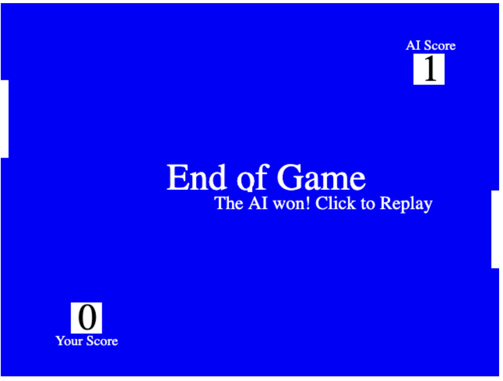

# Pong-Game-HTML

Implemented a basic pong game with javascript. Simply play the game by opening the html file in a web browser.

User can interact with the game by simply using mouse. A simple ai that competes against the human player is also implemented

Game Rules:
Pong is a two-player game where each player controls a paddle. The goal is to hit the ball past the opponent's paddle and score points. The following rules govern the gameplay:

Paddle Movement: Players control their paddles vertically, moving them up or down within their designated half of the game board. The paddle follows the movement of the mouse cursor or touch input.
Ball Mechanics: The ball starts at the center of the game board and moves at a constant speed. It bounces off the paddles, the top, and the bottom edges of the canvas.
Scoring Points: When a player fails to hit the ball with their paddle, the opposing player scores a point. The ball is then reset to the center, and the game continues.
Winning the Game: The game is typically played to a predetermined winning score. The first player to reach or exceed this score wins the game.

